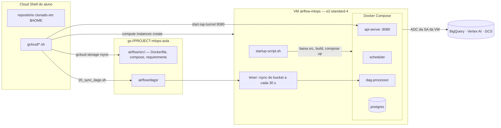

# Plano de implementação — Airflow na GCP, instalado pelo Cloud Shell

Documento para os docentes. Define **como o ambiente Airflow de cada aluno é criado, acessado, alimentado com DAGs e destruído**, tudo por scripts executados no **Cloud Shell**. O conteúdo pedagógico está em [`planejamento.md`](planejamento.md).

---

## 1. Requisitos

| # | Requisito | Consequência no desenho |
|---|---|---|
| R1 | Roda na GCP, no projeto de cada aluno (`Owner`) | Nada depende do projeto do docente, exceto contingência |
| R2 | Instalação automática com **um comando** no Cloud Shell | `gcloud/instalar_airflow.sh` encadeia os passos |
| R3 | Cloud Shell é efêmero (cai após ~20 min sem interação, só o `$HOME` persiste) | O trabalho pesado roda **na VM** (startup script); o Cloud Shell só dispara e consulta. Todo script é **idempotente** e pode ser repetido depois de uma queda |
| R4 | Aluno precisa enviar e atualizar DAGs sem SSH nem Docker | DAGs vão para um **bucket**, a VM sincroniza sozinha (mesmo modelo do Cloud Composer) |
| R5 | UI acessível sem expor a VM à internet | Túnel IAP até a porta 8080 + **Web Preview** do Cloud Shell |
| R6 | Credencial sem chave JSON | Service account anexada à VM; os containers usam ADC pelo metadata server |
| R7 | Custo previsível e encerramento garantido | Uma VM `e2-standard-4` por aluno; script de remoção; teardown em DAG e em script |
| R8 | Mesmas versões do treino da aula anterior | Imagem com `scikit-learn==1.6.*` (casa com `sklearn-cpu.1-6`) |

---

## 2. Arquitetura



**Por que VM e não Cloud Composer para os alunos:** criação do Composer leva ~25 min e o custo fixo por ambiente é bem maior que o da VM; para 20+ alunos, pesa nos créditos. O Composer entra como **demonstração do docente** (`80_composer_demo.sh`) — e o modelo "DAGs num bucket" da seção 5 é o mesmo dele, então a transição é natural.

---

## 3. Fluxo do aluno no Cloud Shell

```bash
# 1. clonar (uma vez; fica no $HOME)
git clone <URL_DO_REPOSITORIO>.git
cd pdm-pipeline-mlops

# 2. instalar (idempotente; ~10 min, a maior parte na VM)
bash gcloud/instalar_airflow.sh

# 3. abrir a UI: deixa o túnel rodando e clica em Web Preview -> Preview on port 8080
bash gcloud/30_abrir_ui.sh

# 4. durante a aula: editar a DAG no Cloud Shell Editor e enviar
bash gcloud/20_sync_dags.sh          # DAG aparece na UI em até ~1 min

# diagnóstico a qualquer momento
bash gcloud/40_status.sh

# 5. fim da aula
#    (a) disparar a DAG teardown_mlops na UI
bash gcloud/99_remover_airflow.sh    # remove VM, firewall e arquivos do Airflow no bucket
```

O projeto é lido de `PROJECT_ID`, senão de `gcloud config get-value project`, senão de `DEVSHELL_PROJECT_ID`. Se nenhum existir, o script para e mostra `gcloud config set project SEU_PROJECT_ID`.

---

## 4. Especificação dos scripts (`gcloud/`)

Convenções comuns: `set -euo pipefail`; todos fazem `source "$(dirname "$0")/config.sh"`; cada recurso é **verificado antes de criado** (`describe` → cria só se faltar); mensagens com prefixo `[ok]`, `[criando]`, `[erro]`; nenhum prompt interativo (`--quiet`).

### 4.1 `config.sh` — variáveis únicas

| Variável | Padrão | Observação |
|---|---|---|
| `PROJECT_ID` | ver seção 3 | |
| `REGION` / `ZONE` | `us-central1` / `us-central1-a` | Mesma região da gold |
| `BUCKET` | `${PROJECT_ID}-mlops-aula` | O mesmo da aula anterior |
| `GOLD_TABLE` | `${PROJECT_ID}.aula_pdm.imoveis_gold` | Ajustar por turma |
| `VM_NAME` | `airflow-mlops` | |
| `VM_TYPE` | `e2-standard-4` | `e2-standard-2` se a quota de CPU for 8 |
| `VM_DISK` | `50` GB `pd-standard` | Não consome a quota `SSD_TOTAL_GB` que travou o Colab |
| `SA_NAME` | `airflow-mlops` | |
| `AIRFLOW_IMAGE_BASE` | `apache/airflow:<3.x fixada>-python3.11` | Fixar no ensaio |
| `AIRFLOW_IMAGE_PRONTA` | vazio | Se preenchida, a VM **puxa** essa imagem em vez de fazer build (otimização, seção 7) |
| `USAR_NAT` | `false` | `true` cria Cloud Router + NAT e a VM fica sem IP externo |

### 4.2 `00_setup.sh` — pré-condições do projeto (~1–2 min)

1. Confere projeto e faturamento (`gcloud billing projects describe`).
2. Habilita APIs: `compute`, `iap`, `aiplatform`, `bigquery`, `storage`, `logging`. (Habilitar `compute` pela primeira vez leva ~1 min.)
3. Bucket `${BUCKET}`: cria em `us-central1` se faltar (uniform access, public access prevention).
4. Gold: `bq show` em `GOLD_TABLE`; se faltar, **para** e orienta rodar o `seed_gold.sh` da aula anterior.
5. Avisa (sem apagar) se houver endpoint ou runtime do Colab ligados da aula anterior.

### 4.3 `10_airflow_vm.sh` — rede, identidade e VM (~1 min no Cloud Shell)

1. **Service account** `airflow-mlops` e papéis: `bigquery.dataEditor` e `bigquery.jobUser`, `storage.objectAdmin`, `aiplatform.user`, `logging.logWriter`. (Os papéis de BigQuery e Storage podem ser restringidos ao dataset e ao bucket como refinamento.)
2. **Firewall** `allow-iap-airflow`: entrada TCP 22 e 8080 apenas de `35.235.240.0/20` (faixa do IAP), na tag `airflow-mlops`.
3. Se `USAR_NAT=true`: Cloud Router `airflow-router` + NAT `airflow-nat` em `us-central1`.
4. **Envia o código-fonte** da pasta `airflow/` (Dockerfile, compose, requirements) para `gs://${BUCKET}/airflow/src/` e as DAGs para `gs://${BUCKET}/airflow/dags/`.
5. **Cria a VM** (se não existir):
   - imagem `debian-12` (já traz `gcloud`), disco `pd-standard`, tag `airflow-mlops`, SA acima com escopo `cloud-platform`;
   - `--metadata-from-file startup-script=gcloud/startup-script.sh`;
   - `--metadata` com `bucket`, `projeto`, `regiao`, `gold-table`, `airflow-image-base`, `airflow-image-pronta`, `enable-guest-attributes=TRUE`;
   - IP externo efêmero (sem regra de entrada além do IAP) ou `--no-address` com NAT.
6. **Espera a VM ficar pronta** consultando o *guest attribute* `airflow/status` (seção 6) a cada 15 s, até 15 min, mostrando a fase atual. Se o Cloud Shell cair, rodar de novo o script retoma só a espera.

### 4.4 `20_sync_dags.sh` — enviar DAGs (segundos)

`gcloud storage rsync --recursive --delete-unmatched-destination-objects airflow/dags gs://${BUCKET}/airflow/dags`, depois lista o que foi enviado. Detalhes na seção 5.

### 4.5 `30_abrir_ui.sh` — acesso à UI

`gcloud compute start-iap-tunnel ${VM_NAME} 8080 --local-host-port=localhost:8080 --zone ${ZONE}` em primeiro plano, com instrução impressa: **Web Preview → Preview on port 8080**, usuário e senha da aula. Usa túnel direto para a porta, **sem `gcloud compute ssh`** — evita a geração interativa de chave SSH no primeiro uso. Se a porta 8080 estiver ocupada no Cloud Shell, usa 8081 e avisa.

### 4.6 `40_status.sh` — diagnóstico

Estado da VM; *guest attribute* `airflow/status`; últimas linhas de `/var/log/airflow-setup.log` via `get-serial-port-output`; lista de DAGs no bucket; endpoints e modelos existentes no Vertex AI. É o primeiro comando a pedir quando um aluno travar.

### 4.7 `instalar_airflow.sh`

Chama `00_setup.sh` → `10_airflow_vm.sh` → `20_sync_dags.sh` e termina com a instrução de rodar `30_abrir_ui.sh`. Reexecutável de qualquer ponto.

### 4.8 `90_teardown_ml.sh` — fallback do teardown

Mesma ordem da DAG `teardown_mlops` (undeploy → endpoint → versões/modelo → `models/rf/` → tabelas `aula_pdm.treino_*`), para quando a VM já não existe ou a DAG falhou. Só apaga o que tem os nomes da aula; **nunca** toca `${PROJECT_ID}-aula-pdm` nem a gold.

### 4.9 `99_remover_airflow.sh`

Remove VM, firewall, router/NAT (se criados) e o prefixo `airflow/` do bucket. Antes, avisa se ainda houver endpoint com modelo implantado e sugere rodar a DAG de teardown ou o `90_teardown_ml.sh`. Mantém a service account (custo zero) para reinstalação rápida; `REMOVER_SA=true` apaga também.

### 4.10 `80_composer_demo.sh` — só docente

Cria um ambiente Composer 3 pequeno e importa as mesmas DAGs (`gcloud composer environments storage dags import`). Rodar **na véspera** (~25 min) e apagar depois da aula. Conferir que a versão de Airflow do Composer é compatível com a usada na VM (seção 9).

---

## 5. Como as DAGs chegam ao Airflow

Modelo escolhido: **bucket como fonte da verdade, VM sincroniza** — o mesmo que o Cloud Composer usa (`gs://<bucket-do-composer>/dags`).

```
Cloud Shell Editor            gs://PROJECT-mlops-aula/airflow/dags/          VM: /opt/airflow-dags  ->  /opt/airflow/dags (container)
  airflow/dags/*.py  --20_sync_dags.sh-->  *.py, sql/, comum/  --timer 30 s-->  (bind mount, somente leitura)
```

| Etapa | Mecanismo | Tempo até aparecer na UI |
|---|---|---|
| Aluno salva o arquivo no Cloud Shell Editor | — | — |
| `20_sync_dags.sh` | `gcloud storage rsync` para o bucket | segundos |
| VM puxa | `systemd` timer a cada 30 s: `gcloud storage rsync --delete-unmatched-destination-objects gs://.../airflow/dags /opt/airflow-dags` | ≤ 30 s |
| Airflow lê | `dag-processor` com intervalo de varredura reduzido para 30 s (variável de ambiente no compose) | ≤ 30 s |

Decisões:

- **`--delete-unmatched-destination-objects`**: apagar um arquivo localmente remove a DAG do Airflow. O espelho é exato.
- **SQL e módulos auxiliares** (`dags/sql/`, `dags/comum/`) vão juntos; a pasta `dags/` está no `PYTHONPATH` do Airflow, então `from comum.config import ...` funciona.
- **Gabarito fora de `dags/`** (`airflow/gabarito/`) para não registrar duas DAGs com o mesmo `dag_id`. Se um aluno ficar para trás, o docente orienta: `cp airflow/gabarito/pipeline_preco_imoveis.py airflow/dags/ && bash gcloud/20_sync_dags.sh`.
- **Erro de sintaxe** aparece no topo da UI (*DAG Import Errors*); não derruba as outras DAGs.
- **Por que não editar na VM por SSH:** exige chave SSH no Cloud Shell, editor de terminal e deixa a VM como fonte da verdade — some ao remover a VM. **Por que não Git na VM:** precisaria de credencial do GitHub na VM; fica como extensão (CI/CD publicando no bucket, igual ao fluxo de produção com Composer).
- **Variáveis da DAG** (projeto, bucket, gold) não ficam no código: o startup script grava no `.env` como `AIRFLOW_VAR_*`, lidas com `Variable.get`. A mesma DAG roda em qualquer projeto sem edição.

---

## 6. `startup-script.sh` — o que roda na VM

Roda como root a cada boot; cada fase é idempotente e grava log em `/var/log/airflow-setup.log` e o progresso no *guest attribute* `airflow/status`:

| Fase (`airflow/status`) | Ação |
|---|---|
| `instalando-docker` | Instala Docker Engine e plugin Compose se faltarem (repositório oficial do Docker) |
| `baixando-codigo` | Lê metadados; `gcloud storage rsync gs://.../airflow/src /opt/airflow-src`; gera `.env` com `AIRFLOW_UID`, `AIRFLOW_VAR_*` e credenciais da UI |
| `construindo-imagem` | `docker compose build` (ou `docker pull` de `AIRFLOW_IMAGE_PRONTA`) |
| `sincronizando-dags` | Primeira sincronização; instala `airflow-dags-sync.service` + `.timer` (30 s) |
| `iniciando-airflow` | `docker compose up -d` (o `airflow-init` migra o banco e cria o usuário) |
| `pronto` | Healthcheck do api-server respondeu em `localhost:8080` |
| `erro:<fase>` | Falhou; detalhe no log |

Publicação do status: `curl -X PUT -H "Metadata-Flavor: Google" --data "<fase>" http://metadata.google.internal/computeMetadata/v1/instance/guest-attributes/airflow/status`.

Leitura no Cloud Shell: `gcloud compute instances get-guest-attributes airflow-mlops --zone us-central1-a --query-path=airflow/status`.

---

## 7. Imagem e Docker Compose (`airflow/`)

- **Base:** imagem oficial `apache/airflow:<3.x>-python3.11`, versão fixada no ensaio e registrada em `config.sh`.
- **`requirements.txt`:** `apache-airflow-providers-google`, `google-cloud-aiplatform`, `scikit-learn==1.6.*`, `joblib`, `db-dtypes` — versões exatas após o ensaio. Instalar com o arquivo de *constraints* do Airflow para não quebrar dependências.
- **Compose:** derivado do `docker-compose.yaml` oficial, reduzido para **LocalExecutor + Postgres** (sem Celery, Redis, Flower). Serviços: `postgres`, `airflow-init`, `airflow-apiserver` (8080), `airflow-scheduler`, `airflow-dag-processor`, `airflow-triggerer`. `restart: unless-stopped`, para voltar sozinho se a VM reiniciar.
- **Volumes:** `/opt/airflow-dags:/opt/airflow/dags:ro`; logs em volume nomeado.
- **Credencial GCP:** nenhuma configuração; ADC resolve via metadata server da VM. Conexão `google_cloud_default` sem chave.
- **UI:** usuário/senha fixos da aula (`airflow`/`airflow`) — aceitável porque a porta só é alcançável pelo IAP, que exige ser principal do projeto. Conferir no ensaio o *auth manager* padrão da versão fixada.
- **Otimização (se o build passar de ~6 min no ensaio):** docente constrói a imagem uma vez com Cloud Build, publica num repositório do Artifact Registry **com leitura pública**, e `AIRFLOW_IMAGE_PRONTA` aponta para ela. A VM só faz `docker pull` (~1–2 min).

---

## 8. Restrições do Cloud Shell e como o desenho responde

| Restrição | Resposta |
|---|---|
| Sessão cai após ~20 min sem interação; VM do Cloud Shell é reciclada | Instalação pesada roda na VM; scripts retomam do ponto em que pararam |
| Só `$HOME` (5 GB) persiste | Nada é instalado fora do repositório; nenhum build de imagem no Cloud Shell |
| Primeiro uso de `gcloud` abre "Authorize Cloud Shell" | Avisar no `01-setup-airflow-gcp.md`; o script falha com mensagem clara se não autorizado |
| Projeto pode não estar configurado | Ordem de resolução da seção 3, com mensagem de correção |
| `gcloud compute ssh` pede passphrase na primeira vez | Scripts não usam SSH; túnel IAP direto para a porta 8080 |
| Web Preview acessa só portas locais do Cloud Shell | Túnel IAP publica a 8080 da VM em `localhost:8080` |
| Túnel cai junto com a sessão | Rodar `30_abrir_ui.sh` de novo; o Airflow na VM não é afetado |

---

## 9. Riscos e pontos a confirmar no ensaio

| Risco | Mitigação |
|---|---|
| Quota de CPU baixa em contas educacionais (ex.: 8 vCPU) | `VM_TYPE=e2-standard-2`; `00_setup.sh` mostra a quota `CPUS` da região |
| Política da organização bloqueia IP externo | `USAR_NAT=true` |
| Política da organização exige OS Login / bloqueia criação de SA | Testar num projeto de aluno real antes; plano B: VM do docente compartilhada na tela |
| Build da imagem lento ou falha de rede no Docker Hub | Imagem pronta no Artifact Registry (seção 7) |
| Incompatibilidade de versões Airflow × provider Google × `scikit-learn` | Constraints oficiais; fixar e testar o trio junto |
| Composer da demonstração com Airflow de versão maior diferente da VM | DAG escrita só com o que existe nas duas versões, ou demonstrar o Composer apenas como "onde a DAG iria morar" |
| Aluno esquece a VM ligada | `99_remover_airflow.sh` no roteiro de encerramento; budget com alerta; docente roda `gcloud compute instances list` no fim |

---

## 10. Terraform (autoestudo)

`terraform/` reproduz a seção 4.3 como IaC: `google_service_account` + `google_project_iam_member`, `google_compute_firewall`, `google_compute_router` / `google_compute_router_nat` (condicionados a `usar_nat`), `google_compute_instance` com o **mesmo** `startup-script.sh` via `metadata`. Sem backend remoto (state local do aluno). A sincronização das DAGs continua pelo `20_sync_dags.sh`. Não é usado na aula ao vivo.

---

## 11. Ordem de implementação e critérios de pronto

**Atenção ao prazo:** hoje é quinta-feira, 08/10. Se a aula é amanhã, implementar na ordem abaixo e parar no MVP se o tempo apertar; as fases 4 e 5 podem ficar como demonstração do docente.

| Fase | Entrega | Pronto quando | Esforço |
|---|---|---|---|
| 1 — MVP do ambiente | `config.sh`, `00`, `10`, `startup-script.sh`, `Dockerfile`, `requirements.txt`, `docker-compose.yaml`, `30_abrir_ui.sh` | Num projeto limpo, `instalar_airflow.sh` termina em `pronto` e a UI abre pelo Web Preview | 3–4 h |
| 2 — DAGs chegando | `20_sync_dags.sh`, timer na VM, DAG `hello` | Editar no Cloud Shell → aparece na UI em ≤ 1 min; apagar → some | 1 h |
| 3 — DAG da aula | `gabarito/`, `comum/`, `sql/`, `teardown_mlops.py`, versão aluno com TODOs | Execução aprovada, reprovada e revertida; teardown limpa tudo | 4–5 h |
| 4 — Operação | `40_status.sh`, `90_teardown_ml.sh`, `99_remover_airflow.sh` | Remoção deixa o projeto sem VM, firewall e endpoint | 1 h |
| 5 — Docs e extras | `01`–`07`, `README`s, `roteiro-condutor.md`, Terraform, `80_composer_demo.sh` | Material revisado por um segundo docente | 3+ h |

### Testes de aceitação

| # | Cenário | Esperado |
|---|---|---|
| T1 | Projeto limpo, `instalar_airflow.sh` | `pronto` em ≤ 12 min |
| T2 | Rodar `instalar_airflow.sh` de novo | Nada recriado; termina em segundos |
| T3 | Fechar o Cloud Shell no meio da espera e reabrir | `10_airflow_vm.sh` retoma a espera; VM conclui sozinha |
| T4 | `sudo reboot` na VM | Airflow volta sozinho, histórico de execuções preservado |
| T5 | Enviar DAG com erro de sintaxe | Aparece em *Import Errors*; demais DAGs seguem funcionando |
| T6 | DAG da aula, execução completa | `promover` em verde; endpoint responde com a versão nova |
| T7 | `teardown_mlops` + `99_remover_airflow.sh` | Nenhum endpoint, VM ou firewall; gold e `-aula-pdm` intactos |
| T8 | Projeto com `USAR_NAT=true` | Mesmo resultado de T1 sem IP externo |
