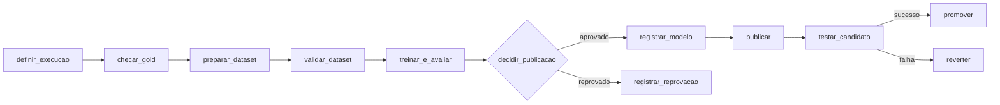

# Planejamento — Aula 2: Pipeline de MLOps orquestrado com Airflow

**Continuação de:** [`aula-mlops-experiments-registry`](https://github.com/lucas-wa/pdm-mlops-practice/tree/main/docs/aula-mlops-experiments-registry) (Experiments + Model Registry + Endpoint, feito **à mão** pelo notebook e pelo console).

**Objetivo do encontro:** transformar o fluxo manual da aula anterior em uma **DAG do Airflow** que prepara os dados, treina, avalia, registra, **decide por métrica** e publica — preservando a versão em produção quando o candidato for reprovado.

**Duração de referência:** 180 minutos (mesma referência do Dia 2 em `planejamento-aulas-mlops-gcp.md`). Há uma versão de 120 minutos na seção 10.

**Premissa:** cada aluno continua no **próprio projeto GCP** (`Owner`), com a gold em `aula_pdm` e o bucket `${PROJECT_ID}-mlops-aula` em `us-central1`, como na aula anterior.

---

## 1. Ponte com a aula anterior: o que era manual vira tarefa

A abertura da aula é esta tabela. Cada linha é uma dor real da aula passada e a tarefa da DAG que a resolve.

| Na aula passada (manual) | Problema | Na DAG |
|---|---|---|
| Rodar a célula que lê a gold | Ninguém sabe depois **quais dados** treinaram o modelo | `preparar_dataset` materializa uma tabela **por execução** (`aula_pdm.treino_<execucao>`) |
| `ORDER BY id` + `random_state=42` para o split ficar igual | Split depende da ordem das linhas e da biblioteca; dedup feita em pandas | Dedup e split **em SQL**, por hash da chave do imóvel: determinístico e sem imóvel em dois conjuntos |
| Olhar o `describe()` e "parece ok" | Gold com problema só aparece no MAE | `checar_gold` e `validar_dataset` (`BigQueryCheckOperator`) **interrompem** a DAG |
| Escolher o run vencedor "no olho" | Decisão sem regra escrita | `decidir_publicacao` (branch): regra explícita contra baseline **e** contra o campeão atual |
| `models/rf/model.joblib` sobrescrito a cada treino | v1 e v2 do Registry apontavam para o **mesmo arquivo** | Artefato em `models/rf/<execucao>/model.joblib`, imutável |
| `Model.upload` v1, depois v2 com `parent_model` à mão | Fácil criar modelo solto no catálogo | `registrar_modelo` sempre usa `parent_model` quando já existe e marca alias `candidato` |
| Deploy pelo console, 10–20 min olhando a tela | Troca de versão sem teste nem volta | `publicar` → `testar_candidato` → `promover` / `reverter` |
| Checklist de teardown clicado item a item | Esquecer o endpoint queima crédito | DAG `teardown_mlops`, disparada manualmente, na mesma ordem do `05-encerramento-custos.md` |

**Frase do bloco:** "Na sexta passada vocês foram o orquestrador. Hoje o Airflow assume esse papel, e cada decisão que vocês tomaram de cabeça vira código revisável."

---

## 2. Objetivos de aprendizagem

Ao final, o aluno deve conseguir:

1. Explicar DAG, tarefa, operador, dependência, tentativa (`retries`), parâmetro de execução e XCom — e por que **só referências** (nomes de tabela, URIs) trafegam no XCom.
2. Usar operadores do provider Google (`BigQueryInsertJobOperator`, `BigQueryCheckOperator`) para preparar e validar dados.
3. Encapsular o treino do notebook em uma tarefa que registra o run no **Vertex AI Experiments** e grava um artefato **imutável** por execução.
4. Escrever uma **regra de aprovação** (branch) e explicar a diferença entre **registrar** e **promover**.
5. Publicar uma nova versão no endpoint, testá-la e reverter sem derrubar a versão anterior.
6. Provocar uma reprovação e mostrar que o serviço continuou respondendo com o campeão.
7. Encerrar todos os recursos com uma DAG de teardown.

---

## 3. Decisões de arquitetura

### 3.1 Onde o Airflow roda — **recomendação: Airflow em Docker Compose numa VM do Compute Engine, uma por aluno**

| Opção | Prós | Contras | Uso nesta aula |
|---|---|---|---|
| **A — VM `e2-standard-4` + Docker Compose (LocalExecutor)** | Ambiente igual para todos; credencial vem da service account da VM (sem chave JSON); ~US$ 0,13/h; sobe em minutos a partir de script/Terraform | Precisa de túnel IAP para abrir a UI | **Recomendada** |
| B — Cloud Composer 3 | Airflow gerenciado, o "jeito de produção" na GCP | Criação leva ~25 min; custo fixo por hora bem maior que a VM; um ambiente por aluno pesa nos créditos | **Só demonstração** pelo docente, num ambiente já criado |
| C — Docker Compose no notebook do aluno | Custo zero na GCP | Máquinas heterogêneas (Windows, pouca RAM), autenticação ADC frágil, tempo de pull da imagem na rede da sala | Plano B se a VM falhar |

Justificativa: o foco da aula é **o pipeline**, não operar Airflow. A VM dá um ambiente previsível e barato, e o Composer aparece como o destino natural em produção ("o código da DAG é o mesmo; muda quem opera o Airflow").

Cuidados herdados da aula anterior:

- **Quota `SSD_TOTAL_GB`:** o runtime do Colab Enterprise reservava ~200 GiB de SSD. Usar disco **`pd-standard`** na VM e confirmar que não há runtimes ligados no projeto.
- **Versões fixas:** imagem do Airflow construída com `scikit-learn==1.6.*` (casa com `sklearn-cpu.1-6`), `google-cloud-aiplatform` e `apache-airflow-providers-google` com versões pinadas no ensaio. O esqueleto abaixo usa a TaskFlow API do Airflow 3 (`airflow.sdk`); em Airflow 2.10 o import é `airflow.decorators` e o resto é igual.

### 3.2 Onde o treino roda — **dentro da tarefa do Airflow**

A gold é pequena e o modelo é o mesmo `RandomForestRegressor` (`n_jobs=2`) do notebook. Treinar no próprio worker mantém continuidade direta com o código da aula passada e evita mais um serviço a configurar.

Mencionar como evolução (sem executar): em dados maiores, a tarefa de treino vira um **Vertex AI Custom Training Job** (`CreateCustomTrainingJobOperator`) e o Airflow só dispara e acompanha. A regra "o orquestrador coordena, não processa" deve ser dita em aula.

### 3.3 Onde o modelo é servido — **o mesmo Vertex AI Endpoint da aula passada**

Mantém o contrato de entrada (ordem canônica `[area_util, area_total, quartos, banheiros, garagens]`) e tudo que os alunos já viram. A novidade é o **blue/green no endpoint**: a versão nova entra com 100% do tráfego **com a versão anterior ainda implantada** (0%); se o teste falhar, o tráfego volta para a anterior sem novo deploy de 10–20 minutos.

---

## 4. Desenho da DAG `pipeline_preco_imoveis`



| Tarefa | Operador | Faz | Sai no XCom (só referências) |
|---|---|---|---|
| `definir_execucao` | `@task` | Gera o identificador da execução (`YYYYMMDDHHMMSS`) e deriva todos os nomes | `{sufixo, tabela, gcs_dir, run_name}` |
| `checar_gold` | `BigQueryCheckOperator` | Gold existe, tem linhas, `preco` válido em ≥ X% | — |
| `preparar_dataset` | `BigQueryInsertJobOperator` | `CREATE TABLE aula_pdm.treino_<sufixo>` com dedup, colunas do contrato e coluna `conjunto` (treino/validacao/teste) | — |
| `validar_dataset` | `BigQueryCheckOperator` | Mínimo de linhas por conjunto; nenhum imóvel em dois conjuntos; sem nulos no alvo | — |
| `treinar_e_avaliar` | `@task` | Lê a tabela, treina, calcula `mae`, `mae_baseline` e `mae_campeao` **na mesma validação**, loga no Experiments, grava `gs://.../models/rf/<sufixo>/model.joblib` | `{mae, mae_baseline, mae_campeao, gcs_dir, run_name}` |
| `decidir_publicacao` | `@task.branch` | `mae < mae_baseline` **e** (`sem campeão` **ou** `mae < mae_campeao`) | id da próxima tarefa |
| `registrar_modelo` | `@task` | `Model.upload` com `parent_model` se já existir, labels `execucao`, alias `candidato` | `model_resource_name`, `version_id` |
| `registrar_reprovacao` | `@task` | Loga a reprovação no run do Experiments (`aprovado=0`) e encerra | — |
| `publicar` | `@task` (timeout 30 min, `retries=0`) | Cria o endpoint se não existir; deploy da versão com 100% do tráfego, mantendo a anterior a 0% | `endpoint`, `deployed_model_id`, `anterior_id` |
| `testar_candidato` | `@task` | Predição com o payload de referência; confere `model_version_id` e faixa plausível de preço | — |
| `promover` | `@task` | Move alias `campeao` para a versão; desimplanta a anterior | — |
| `reverter` | `@task` (`trigger_rule="one_failed"`) | Devolve 100% para a anterior; desimplanta o candidato | — |

**Parâmetros da DAG** (`Trigger DAG w/ config`): `n_estimators` (200), `max_depth` (12), `min_linhas` (ex.: 200). São eles que permitem provocar a reprovação ao vivo sem editar código.

**Configurações de operação:** `schedule=None` na aula (disparo manual); `retries=2` nas tarefas de BigQuery; `retries=0` no deploy (repetir automaticamente criaria implantações duplicadas e custo); `max_active_runs=1` (duas execuções disputando o mesmo endpoint é um bug).

### 4.1 SQL de preparação (núcleo da tarefa `preparar_dataset`)

```sql
CREATE OR REPLACE TABLE `{{ params.projeto }}.aula_pdm.treino_{{ ti.xcom_pull('definir_execucao')['sufixo'] }}` AS
WITH unicos AS (
  SELECT id, area_util, area_total, quartos, banheiros, garagens, preco
  FROM `{{ params.gold_table }}`
  WHERE preco IS NOT NULL AND preco > 0
  -- uma linha por imóvel (a gold é append-only)
  QUALIFY ROW_NUMBER() OVER (PARTITION BY id ORDER BY id) = 1
)
SELECT
  *,
  -- split determinístico POR IMÓVEL: o mesmo id cai sempre no mesmo conjunto,
  -- independente da ordem das linhas ou de quem executa
  CASE
    WHEN MOD(ABS(FARM_FINGERPRINT(CAST(id AS STRING))), 100) < 70 THEN 'treino'
    WHEN MOD(ABS(FARM_FINGERPRINT(CAST(id AS STRING))), 100) < 85 THEN 'validacao'
    ELSE 'teste'
  END AS conjunto
FROM unicos;
```

Pontos para discutir em aula: o split por hash resolve o problema do `ORDER BY` + `random_state`; a tabela por execução é o **snapshot** que torna o treino reproduzível; o `ORDER BY` dentro do `ROW_NUMBER` deve usar uma coluna de atualização se a gold tiver (ex.: `data_coleta DESC`) — confirmar com o schema da turma.

### 4.2 Código da DAG

- Versão do aluno: [`airflow/dags/pipeline_preco_imoveis.py`](airflow/dags/pipeline_preco_imoveis.py) + [`airflow/dags/sql/preparar_dataset.sql`](airflow/dags/sql/preparar_dataset.sql), com os TODOs 1 (split no SQL), 2 (log no Experiments) e 3 (regra do branch).
- Gabarito: [`airflow/gabarito/`](airflow/gabarito/), fora de `dags/` para não registrar dois `dag_id` iguais.
- Teardown: [`airflow/dags/teardown_mlops.py`](airflow/dags/teardown_mlops.py).

As duas versões foram carregadas com sucesso num Airflow 3.1.0 local (sem erros de importação, dependências conforme o desenho acima). A execução contra a GCP ainda precisa ser feita no ensaio.

## 5. Regras de MLOps que a DAG implementa

Dizer em voz alta e apontar no código:

1. **Identificador da execução é o fio da meada:** o mesmo `sufixo` nomeia a tabela, o diretório do artefato, o run do Experiments e o label da versão no Registry. Dado um preço servido, chega-se aos dados que o treinaram.
2. **Comparar na mesma régua:** o campeão é reavaliado **na validação desta execução**, não pelo MAE que ele teve no passado com outros dados.
3. **Registrar ≠ promover:** todo candidato aprovado vira versão no Registry; só o que passa no teste recebe o alias `campeao`. Reprovado não é deletado, é registrado como reprovado no Experiments.
4. **Artefato imutável:** nunca sobrescrever `model.joblib`; cada versão aponta para seu próprio diretório.
5. **XCom carrega endereços, não dados:** nada de DataFrame ou modelo no XCom.
6. **Tarefas idempotentes:** reexecutar uma tarefa (`Clear`) não pode duplicar recurso — `CREATE OR REPLACE`, endpoint reaproveitado se já existir.
7. **O teste de serviço não mede qualidade:** `testar_candidato` verifica que o endpoint responde com a versão certa e um valor plausível; qualidade preditiva foi decidida antes, no `decidir_publicacao`.

---

## 6. Convenções de nomes

Mantém tudo da aula anterior e acrescenta:

| Recurso | Valor |
|---|---|
| Região | `us-central1` |
| Tabela gold | `GOLD_TABLE` (confirmar o nome da turma) |
| Tabelas por execução | `aula_pdm.treino_<sufixo>` |
| Artefatos | `gs://${PROJECT_ID}-mlops-aula/models/rf/<sufixo>/model.joblib` |
| Experiment | `preco-imoveis-rf` (o mesmo; runs da DAG com prefixo `airflow-`) |
| Modelo | `rf-preco-imoveis` |
| Aliases | `candidato`, `campeao` |
| Endpoint | `rf-preco-imoveis-endpoint` |
| DAGs | `pipeline_preco_imoveis`, `teardown_mlops` |
| VM do Airflow | `airflow-mlops` (`e2-standard-4`, `pd-standard` 50 GB, sem regra de entrada além do IAP) |
| Service account da VM | `airflow-mlops@${PROJECT_ID}.iam.gserviceaccount.com` |

Papéis da service account da VM: `roles/bigquery.dataEditor` (no dataset `aula_pdm`), `roles/bigquery.jobUser`, `roles/storage.objectAdmin` (no bucket `-mlops-aula`), `roles/aiplatform.user`, `roles/logging.logWriter`.

Acesso à UI: `bash gcloud/30_abrir_ui.sh` no Cloud Shell (túnel IAP direto para a porta 8080) e **Web Preview → porta 8080**. DAGs chegam pelo bucket: `bash gcloud/20_sync_dags.sh`. Detalhes em [`implementacao-airflow.md`](implementacao-airflow.md).

---

## 7. Agenda (180 minutos)

A aula **começa pelos conceitos**: antes de qualquer comando, cada ferramenta é apresentada com o que é e por que está na aula. Slides: deck da aula. Minuto a minuto em [`roteiro-condutor.md`](roteiro-condutor.md).

| Tempo | Bloco | Slides | Resultado esperado |
|---|---|---|---|
| 000–010 | Abertura | capa → objetivo | Turma enxerga cada clique da aula passada como uma tarefa |
| 010–050 | Conceitos | MLOps, pipeline, Airflow, por que Airflow, DAG, operadores, componentes, XCom/params, falhar bem, ferramentas GCP, VM × Composer | Turma sabe o que é e para que serve cada peça |
| 050–065 | Arquitetura | ambiente, DAGs pelo bucket, a DAG, regras | Turma lê o desenho antes de executar |
| 065–080 | Provisionar e abrir a UI | repositório → gold | Airflow de cada aluno no ar, DAGs visíveis |
| 080–095 | TODO 1 (split) | TODO 1 | Tabela `treino_<sufixo>` ~70/15/15 |
| 095–110 | TODO 2 (Experiments) | TODO 2 | Run `airflow-…` com a tabela |
| 110–120 | TODO 3 (regra) + **disparar execução completa** | TODO 3, executar | Deploy rodando |
| 120–140 | Publicação explicada enquanto provisiona | publicação | Endpoint com a versão campeã |
| 140–155 | Falhas controladas | falhas | Reprovação preserva o campeão |
| 155–170 | Encerramento | encerramento | Nada ligado |
| 170–180 | Entregas e próximos passos | entregas → obrigado | Evidências conferidas |

**A instalação leva ~10 min e roda sozinha na VM.** Recomendado: enviar à turma, na véspera, os três comandos do slide "Provisionar" para rodarem antes da aula. Se não rodaram, pedir no minuto 10 (fim da abertura) e seguir com os conceitos enquanto a VM sobe.

## 8. Contingências

| Situação | O que fazer |
|---|---|
| VM do aluno não sobe ou túnel IAP falha | Aluno acompanha a VM do docente na tela; segue escrevendo os TODOs e valida no fim com o docente de apoio |
| DAG com erro de importação | `docker compose logs airflow-dag-processor` (ou `scheduler` no Airflow 2); quase sempre import ou indentação |
| Deploy passa de 25 min | Seguir a aula com o **endpoint de referência** do docente; a tarefa do aluno conclui depois, antes do teardown |
| `System error. Please try this operation again` no deploy | Falha transitória do Vertex; `Clear` em `publicar` (o endpoint é reaproveitado) |
| Erro de unpickle no endpoint | Versão do scikit-learn da imagem do Airflow não casa com `sklearn-cpu.1-6`; usar a de referência e tratar como caso de estudo |
| Tempo estourou | Cortar na ordem da seção 10; o teardown **nunca** é cortado |

---

## 9. Entregas e critérios de conclusão

Entrega do aluno (prints ou links):

- Graph view de uma execução **aprovada** completa (`promover` em verde).
- Graph view de uma execução **reprovada** (`registrar_reprovacao` em verde, `publicar` *skipped*).
- Run `airflow-<sufixo>` no Experiments com `tabela` e métricas `mae`, `mae_baseline`, `mae_campeao`.
- Predição no endpoint mostrando o `model_version_id` da versão `campeao`.
- Varredura de teardown concluída.

Critérios: pipeline executável de ponta a ponta; dados rastreáveis por execução; aprovação por métrica escrita em código; publicação com teste e reversão; evidência de que a reprovação preservou o serviço.

---

## 10. Versão de 120 minutos

Mesma DAG, com o aluno completando **só o TODO 3** (regra do branch); os TODOs 1 e 2 já vêm prontos e são lidos em aula.

| Tempo | Bloco |
|---|---|
| 000–010 | Retomada (tabela da seção 1) |
| 010–025 | Airflow na UI + leitura da DAG |
| 025–045 | Dados e treino lidos no código; TODO 3; **disparar execução completa** |
| 045–075 | Publicação explicada enquanto provisiona; teste e promoção |
| 075–090 | Uma falha controlada (reprovação) |
| 090–105 | Teardown |
| 105–120 | Fechamento e folga |

Ordem de corte se ainda faltar tempo: (1) falha de validação com `min_linhas`; (2) `Clear` de idempotência; (3) demonstração do Composer; (4) leitura detalhada do SQL.

---

## 11. Preparação antes da aula

### 11.1 Materiais a produzir

Material pronto neste repositório (scripts, imagem, DAGs, gabarito e guias 00–07). Falta apenas `terraform/` (autoestudo, marcado com **A ESCREVER**). Scripts, imagem e forma de envio das DAGs estão especificados em [`implementacao-airflow.md`](implementacao-airflow.md).

### 11.2 Checklist do docente

- [ ] Gold confirmada (nome, colunas, chave do imóvel, coluna de atualização para a dedup).
- [ ] Ambiente da aula passada **encerrado** em cada projeto (endpoint, runtimes) — evita quota e custo duplicado.
- [ ] Versões do Airflow, provider Google, `google-cloud-aiplatform` e `scikit-learn==1.6.*` fixadas e testadas juntas.
- [ ] Imagem do Airflow **pré-construída** e publicada no Artifact Registry (o build ao vivo na VM custa minutos).
- [ ] `gcloud/instalar_airflow.sh` testado no Cloud Shell, num projeto limpo: VM sobe, UI abre pelo túnel, DAG importa sem erro.
- [ ] DAG gabarito executada de ponta a ponta: uma aprovação, uma reprovação, uma reversão provocada (forçar falha em `testar_candidato`) e o teardown.
- [ ] Tempo de cada tarefa anotado, em especial `publicar`.
- [ ] **Endpoint de referência** e **VM de referência** do docente ligados (contingência).
- [ ] Ambiente Composer do docente criado com antecedência, se for demonstrado.
- [ ] Pedir aos alunos que rodem `bash gcloud/instalar_airflow.sh` **antes da aula** (ou no começo, enquanto acontece a retomada).

---

## 12. Extensões (fora do tempo da aula)

- `schedule="@weekly"` com sensor que só treina se a gold recebeu linhas novas.
- Treino como Vertex AI Custom Training Job, deixando o worker do Airflow só como coordenador.
- CI/CD: GitHub Actions valida (`airflow dags test`) e publica a DAG no bucket do Composer a cada merge.
- Teste de dados mais rico (Great Expectations / checagens de distribuição por feature).
- Monitoramento: comparar a distribuição das features recebidas no endpoint com a do treino.
- Mesma DAG reescrita em Vertex AI Pipelines, para comparar orquestradores.

---

## 13. Referências

- Aula anterior: [`aula-mlops-experiments-registry`](https://github.com/lucas-wa/pdm-mlops-practice/tree/main/docs/aula-mlops-experiments-registry) e [`planejamento-aulas-mlops-gcp.md`](https://github.com/lucas-wa/pdm-mlops-practice/blob/main/docs/planejamento-aulas-mlops-gcp.md) (Possibilidade B).
- [Airflow — Docker Compose](https://airflow.apache.org/docs/apache-airflow/stable/howto/docker-compose/index.html).
- [Airflow — TaskFlow API e branching](https://airflow.apache.org/docs/apache-airflow/stable/core-concepts/taskflow.html).
- [Operadores BigQuery do provider Google](https://airflow.apache.org/docs/apache-airflow-providers-google/stable/operators/cloud/bigquery.html).
- [Operadores Vertex AI do provider Google](https://airflow.apache.org/docs/apache-airflow-providers-google/stable/operators/cloud/vertex_ai.html).
- [Cloud Composer](https://docs.cloud.google.com/composer/docs).
- [Vertex AI — aliases de versão no Model Registry](https://docs.cloud.google.com/vertex-ai/docs/model-registry/model-alias).
- [Vertex AI — divisão de tráfego no endpoint](https://docs.cloud.google.com/vertex-ai/docs/general/deployment).
- [IAP para SSH](https://docs.cloud.google.com/iap/docs/using-tcp-forwarding).
